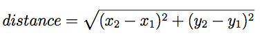

## Chapter 6.2 Notes - Program Development

At this point you should be able to look at complete Java methods and tell what they do. But it may not be clear yet how to go about writing them. I am going to suggest a method called incremental development.

Lets take the following formula for instance.



Consider what a distance method would look like and start simple.

For example

```java
public static double distance()
{
  return 0.0;
}
```
