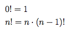
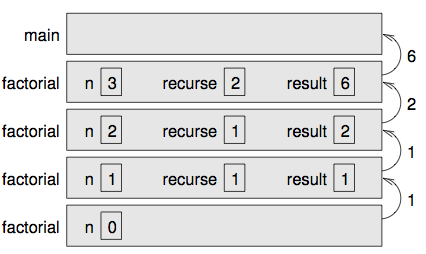

## Chapter 6.8 - More Recursion

[Back](../README.md)

When discussing recursion a great way represent it mathimatically is by using factorials.



(Factorial is usually denoted with the symbol !, which is not to be confused with the logical operator ! which means NOT.) This definition says that the factorial of 0 is 1, and the factorial of any other value, n, is n multiplied by the factorial of n−1. So 3! is 3 times 2!, which is 2 times 1!, which is 1 times 0!. Putting it all together, we get 3! equal to 3 times 2 times 1 times 1, which is 6.

If you can write a recursive definition of something, you can usually write a Java method to evaluate it. The first step is to decide what the parameters are and what the return type is. Since factorial is defined for integers, the method takes an integer as a parameter and returns an integer:
```java
  public static int factorial(int n) {
  }
```
If the argument happens to be zero, return 1:
```java
  public static int factorial(int n) {
    if (n == 0) {
      return 1; 
    }
  }
```
That’s the base case.
Otherwise, and this is the interesting part, we have to make a recursive call
to find the factorial of n − 1, and then multiply it by n.
```java
  public static int factorial(int n) {
    if (n == 0) {
      return 1;
    } else {
      int recurse = factorial(n-1);
      int result = n * recurse;
      return result;
    } 
  }
``
The flow of execution for this program is similar to countdown from Sec- tion 4.8.

If we invoke factorial with the value 3:

Since 3 is not zero, we take the second branch and calculate the factorial of n−1...

  Since 2 is not zero, we take the second branch and calculate the factorial of n − 1...

    Since 1 is not zero, we take the second branch and calculate the factorial of n − 1...

      Since 0 is zero, we take the first branch and re- turn the value 1 immediately without making any more recursive invocations.

    The return value (1) gets multiplied by n, which is 1, and the result is returned.

  The return value (1) gets multiplied by n, which is 2, and the result is returned.

The return value (2) gets multiplied by n, which is 3, and the result, 6, is returned to main, or whoever invoked factorial(3).

Here is the stack diagram:



